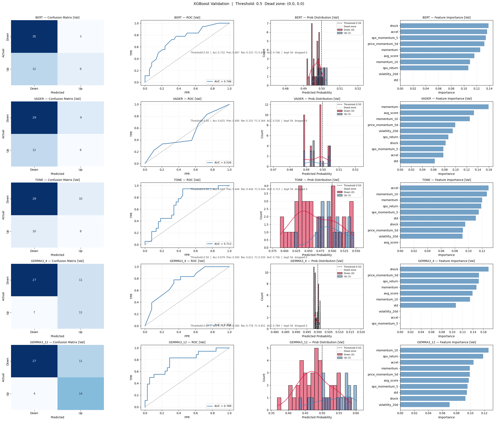
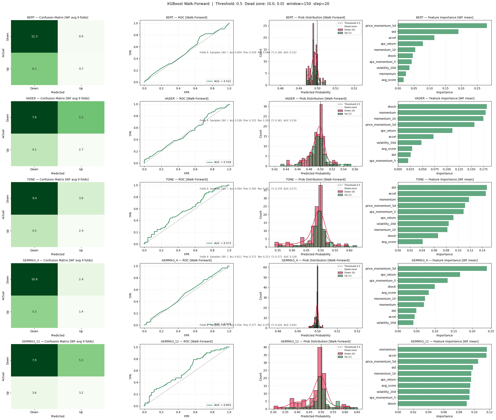
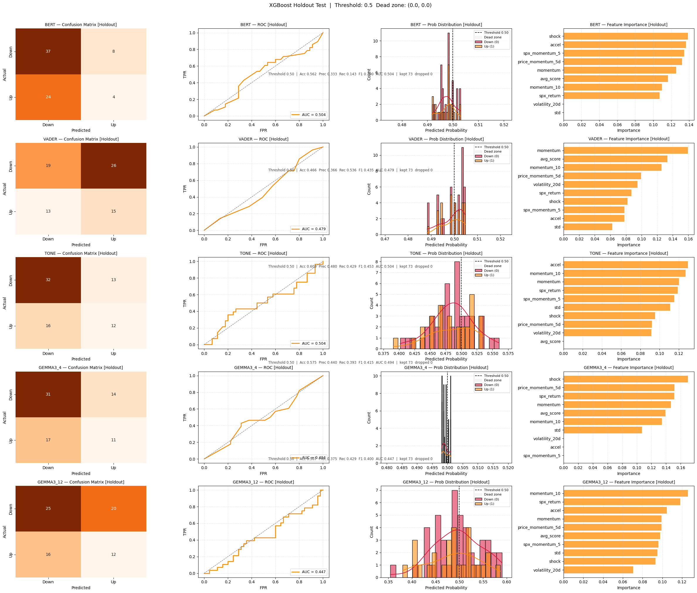

# StockNewsSentiment V.01

A Jupyter Notebook pipeline that fetches financial news headlines, scores them with multiple sentiment models, and trains XGBoost classifiers to predict short-term stock price direction.

The pipeline targets any stock (**NVIDIA (NVDA)** by default) over a configurable time period. The ticker, date range, and model toggles are all controlled by a single configuration cell at the top of the notebook.


**Goal** — The aim is not to build a perfect, or even accurate, price predictor, but to compare some consistent signal results across sentiment models and time periods when possible. It is an evaluation of each sentiment model's ability to create signal from news, comparing old and new models, small and slightly larger models.


---

## How It Works

The pipeline runs end-to-end in a single notebook with the following stages:

**1. Data ingestion** — Headlines are pulled from the [GDELT Project](https://www.gdeltproject.org/) via Google BigQuery, one partition per day. Each day's results are cached to a local Parquet checkpoint so the notebook can resume after interruptions. Only headlines that match the configured keyword list (e.g. `["NVIDIA", "NVDA"]`) are kept.

**2. Sentiment scoring** — Each headline is scored by up to four model types, independently toggled via boolean flags:

| Flag | Model | Notes |
|---|---|---|
| `RUN_FINBERT` | [ProsusAI/FinBERT](https://huggingface.co/ProsusAI/finbert) | Finance-tuned BERT; outputs negative / neutral / positive |
| `RUN_VADER` | VADER (`nltk`) | Lexicon-based; fast, no GPU required |
| `RUN_V2TONE` | GDELT V2Tone | Pre-computed tone score from the GDELT record itself |
| `RUN_OLLAMA` | Any Ollama-served LLM | Defaults to Gemma 3 4B and 12B; any Ollama model can be substituted |

The `LLM_MODELS` list accepts any model ID recognised by your local Ollama installation. Each LLM gets its own score column and its own downstream XGBoost classifier.

**3. Feature engineering** — Daily headline scores are aggregated into per-model feature sets (rolling average, standard deviation, momentum at 5- and 10-day windows, shock, volume, acceleration, extreme-score flag, flip flag). These are joined with price and market features fetched from Yahoo Finance including RSI, price momentum, volatility, VIX, and S&P 500 return.

**4. Binary target** — The target label is whether the stock's *n*-day forward return is positive (`TARGET_HORIZON_DAYS = 1` by default). Target is computed in trading-day space so horizon=N always means N real market sessions regardless of weekends or holidays. Weekend sentiment rows correctly inherit the next available trading day's target.

**5. Model training** — A separate XGBoost classifier is trained for each sentiment model using grid search over hyperparameters on a static train/val split. Walk-forward validation then runs using the best found params to produce an honest out-of-sample performance estimate across rolling time windows. Val metrics are used for param selection only — walk-forward AUC is the primary performance metric.

**6. Evaluation & diagnostics** — Three separate diagnostic figures are produced per run:
- **Validation** (blue) — confusion matrix, ROC curve, zoomed probability distribution, feature importance
- **Walk-forward** (green) — same panels averaged across all rolling folds
- **Holdout** (orange) — final evaluation on untouched test data, only looked at once

A model comparison table prints validation vs walk-forward metrics side by side for every sentiment model.

**7. Trading simulation** — Predictions are converted into long / short / long-short strategies using fresh yfinance data to guarantee only real trading days are used. Returns are shifted by one day so today's signal earns tomorrow's return. A flipped-signal skill check is included to distinguish genuine model skill from market drift.

**8. Session backup** — All DataFrames and trained models are serialised to Parquet and Joblib files in a timestamped backup directory. Sessions can be restored from any backup directory.

---

## Requirements

### Python packages

```
pandas
numpy
pyarrow
requests
joblib
matplotlib
seaborn
scikit-learn
xgboost
torch
transformers
nltk
vaderSentiment
yfinance
google-cloud-bigquery
tqdm
python-dotenv
```

### External services

| Service | Purpose |
|---|---|
| **Google Cloud / BigQuery** | GDELT headline retrieval |
| **Ollama** (local, `http://127.0.0.1:11434`) | Serving local LLMs for sentiment scoring |
| **Yahoo Finance** | Price, VIX, and S&P 500 data via `yfinance` |

### Environment variables

Create a `.env` file in the project root (see `.env.example`):

```
GCP_CREDENTIALS_PATH=path/to/your/service-account.json
GCP_PROJECT_ID=your-gcp-project-id
```

---

## Configuration

All user-facing settings live in the first notebook cell:

```python
# ── Target stock ──────────────────────────────────────────────────────────────
TICKER       = "NVDA"
COMPANY_NAME = "NVIDIA"
KEYWORDS     = ["NVIDIA", "NVDA"]

# ── Date range ────────────────────────────────────────────────────────────────
DATE_FROM = "2025-04-15"
DATE_TO   = "2026-04-15"

# ── Sentiment model toggles ───────────────────────────────────────────────────
RUN_FINBERT = True
RUN_VADER   = True
RUN_V2TONE  = True
RUN_OLLAMA  = True

# ── Ollama / LLM ─────────────────────────────────────────────────────────────
OLLAMA_BASE_URL = "http://127.0.0.1:11434"

LLM_MODELS = [
    ("gemma3_4",  "gemma3:4b"),
    ("gemma3_12", "gemma3:12b"),
    # ("llama3",   "llama3.1:8b"),
    # ("mistral",  "mistral:7b"),
    # ("qwen",     "qwen2.5:7b"),
]

SIM_MODEL = "gemma3_12"

# ── Price / feature engineering ───────────────────────────────────────────────
TARGET_HORIZON_DAYS = 1
LOOKBACK_DAYS       = 80
ROLLING_WINDOW      = 30

# ── Train / val / test split ──────────────────────────────────────────────────
VALIDATION_SPLIT = 0.20
TEST_CUTOFF_DATE = "2026-02-01"

# ── XGBoost ───────────────────────────────────────────────────────────────────
XGB_FEATURES = [
    "avg_score", "momentum", "momentum_10", "std", "shock",
    "volume", "accel", "rsi", "vix", "volatility_20d",
    "spx_return", "price_momentum_5d",
]
TARGET_COL          = "target"
DECISION_THRESHOLD  = 0.5
THRESHOLD_DEAD_ZONE = (0.0, 0.0)
SELECTION_METRIC    = "precision"
SCALE_POS_WEIGHT    = True

XGB_PARAM_GRID = {
    "n_estimators":     [100, 200, 300],
    "max_depth":        [2, 3],
    "min_child_weight": [5, 10, 20],
    "learning_rate":    [0.01, 0.05],
    "subsample":        [0.5, 0.6],
    "colsample_bytree": [0.4, 0.6],
    "gamma":            [1.0, 3.0],
    "reg_alpha":        [1.0, 5.0],
    "reg_lambda":       [5.0, 15.0],
}

# ── Walk-forward validation ───────────────────────────────────────────────────
WF_TRAIN_WINDOW = 150
WF_STEP         = 20

# ── Trading simulation ────────────────────────────────────────────────────────
LONG_THRESHOLD  = 0.500001
SHORT_THRESHOLD = 0.499999

# ── Paths ─────────────────────────────────────────────────────────────────────
SESSION_LOG_DIR = r"D:\PRODStockNews\session_logs"
BACKUP_ROOT     = r"D:\PRODStockNews\backup"
```

---

## Features

### Sentiment features (per model)

| Column suffix | Description |
|---|---|
| `_avg` | Daily mean sentiment score |
| `_std` | Daily standard deviation of scores |
| `_count` | Number of headlines scored that day |
| `_long_term` | Rolling mean of `_avg` over `ROLLING_WINDOW` days |
| `_shock` | Z-score of today's `_avg` vs the long-term baseline |
| `_volume` | Sentiment-weighted article volume: `avg × √count` |
| `_momentum` | Short-term momentum: `avg − 5d_avg` |
| `_momentum_10` | Medium-term momentum: `avg − 10d_avg` |
| `_accel` | Second difference of `_avg` — rate of change of momentum |
| `_extreme` | Binary flag: 1 if `\|avg\| > 0.5` |
| `_flip` | Binary flag: 1 if sentiment direction reversed vs previous day |
| `model_disagreement` | Std dev of `_avg` across all active models |

### Price & market features

| Column | Description |
|---|---|
| `rsi` | 14-day Relative Strength Index |
| `price_momentum_5d` | 5-day price return |
| `price_momentum_20d` | 20-day price return |
| `volatility_20d` | 20-day rolling standard deviation of daily returns |
| `ma_20` / `ma_50` | 20- and 50-day simple moving averages |
| `volume_change` | Day-over-day % change in trading volume |
| `vix` | CBOE Volatility Index close |
| `spx_return` | S&P 500 daily return |
| `spx_momentum_5` | S&P 500 5-day momentum |
| `is_trading_day` | Boolean flag — False on weekends and holidays |

---

## Validation approach

| Layer | Purpose | Bias |
|---|---|---|
| **Static val set** | Param selection during grid search | Optimistic — used to pick the winner |
| **Walk-forward** | Rolling out-of-sample estimate across 9+ windows | Primary metric — harder to game |
| **Holdout test** | Final score on untouched data, looked at once | Ground truth |

---

## Results (v0.1 — Apr 2025 to Apr 2026)

### Dataset

| | |
|---|---|
| Total headlines | 34,890 |
| Days with coverage | 349 |
| Train rows (per model) | 220 |
| Val rows | 56 |
| Holdout rows | 73 |
| Walk-forward folds | 9 (window=150, step=20) |

### Model comparison

| Model | Val AUC | WF AUC | Holdout AUC |
|---|---|---|---|
| BERT | 0.746 | 0.522 | 0.504 |
| VADER | 0.526 | 0.518 | 0.479 |
| TONE | 0.713 | 0.573 | 0.504 |
| GEMMA3_4 | 0.756 | 0.528 | 0.494 |
| **GEMMA3_12** | **0.789** | **0.603** | 0.447 |

### Validation diagnostics



Each row is one sentiment model. Panels: confusion matrix, ROC curve, predicted probability distribution coloured by actual outcome (red = down day, blue = up day), feature importance. GEMMA3_12 shows the strongest ROC (AUC 0.789) and clearest probability separation. VADER, and GEMMA3_4 are predominantly collapsed near 0.5.

### Walk-forward diagnostics



Same layout computed across 9 rolling folds. GEMMA3_12 achieves the best walk-forward AUC (0.603) and is the only model showing meaningful probability spread between up and down days. Feature importance is averaged across all fold models — `price_momentum_5d`, `spx_return`, and `momentum` dominate across most models.

### Holdout test diagnostics



Final evaluation on the Feb–Apr 2026 test period. All models show AUC near 0.5. The Gemma models show inverted probability distributions. Question remains if more/cleaner data will bring signal in testing, or if it is a fundamental model failure.

---

## Output files

| File | Contents |
|---|---|
| `checkpoints_<TICKER>/<TICKER>_<date>.parquet` | Per-day raw headline cache |
| `df_sentiments_final.parquet` | All scored headlines |
| `xgb_<model>_frozen.pkl` | Trained and frozen XGBoost models |
| `xgb_best_thresholds.pkl` | Best thresholds per model |
| `backup_<timestamp>_<top_model>/` | Full session snapshot |

---

## Resuming a session

```python
restore_session(r"D:\PRODStockNews\backup\backup_20260417_2207__BERT_73")
```

---

## Key findings (v0.2)

- Need more data and clearer headlines to make any real findings.
- All models show AUC near 0.5 on holdout 
- **gemma3_12** is the strongest model on walk-forward with an AUC of 0.603, widest probability spread (0.30–0.65 range), tone also showing some promise.
- BERT and VADER probabilities collapse to ~0.499–0.501 — no meaningful discrimination
- TONE has the most balanced holdout performance despite weak walk-forward
- Primary limitation: ~300 usable training rows is insufficient for stable generalisation

## Next steps

- Extend date range to 2022–present (~1500 days) for multi-regime training
- **TF-IDF + NMF topic modeling** — compare topic distributions between up-day and down-day article corpora, weight articles by topic signal score before sentiment aggregation
- Possibly batch LLM prompting to reduce the ~6 hour per-year scoring time, evaluate batch vs single performance.

---

## Notes

- FinBERT requires a CUDA-capable GPU; falls back to CPU if none detected
- Ollama must be running locally before LLM scoring cells execute
- VADER and V2Tone scoring are CPU-only and fast relative to transformer-based models
- `SCALE_POS_WEIGHT = True` is recommended — make sure to use threshold of .5 when true. 
